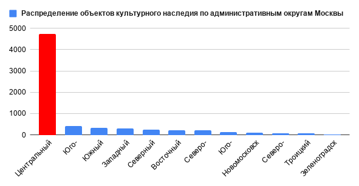
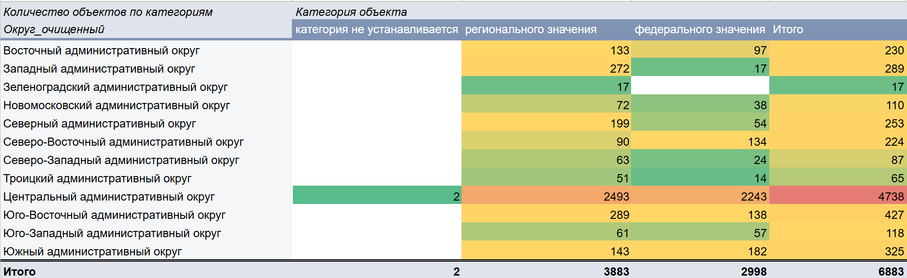
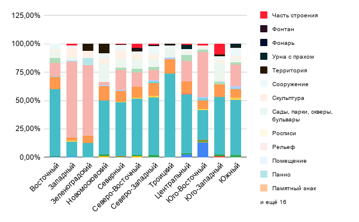

## moscow_cultural_heritage.
# Data driven исследование «Культурное наследие Москвы: концентрация объектов по административным округам» на основе открытого дата-сета
### Синопсис 

Проект анализирует открытый набор данных Правительства Москвы «Объекты культурного наследия города Москвы», который включает объекты культурного наследия и выявленные объекты, в том числе с разделением по категориям, расположенные в пределах Москвы. Цель – показать, как культурное наследие распределено по административным округам и есть ли выраженная концентрация в отдельных частях города.
В ходе работы была проведена очистка и структурирование данных, а также выполнен анализ распределения объектов по округам, категориям и статусам. Результаты позволяют выявить выраженные территориальные диспропорции и особенности исторического развития городской среды.

### Актуальность

Культурное наследие является важным элементом городской идентичности и ресурсом развития территорий. Однако его распределение в пределах города может быть неравномерным, что отражает исторические, социальные и экономические процессы.
Анализ пространственного распределения объектов культурного наследия позволяет выявить «центры притяжения» исторической застройки, а также территории с меньшей насыщенностью культурными объектами.

### Исследовательские вопросы

1. Как распределено количество объектов из набора по административным округам Москвы: какие округа лидируют и какие имеют минимальные значения?
2. Насколько выражена концентрация: какую долю всех объектов дают топ‑1, топ‑3 и топ‑5 округов?
3. Насколько велик разрыв между округом‑лидером и округом‑аутсайдером?
4. Как распределяются категории объектов по округам: какие категории доминируют в каждом округе и отличаются ли «профили» округов?
5. Насколько «разнообразно» наследие по категориям в каждом округе: есть ли округа с широким набором категорий и округа с узкой специализацией?

---

### Данные 

**Источник данных**: [портал открытых данных Правительства Москвы — «Объекты культурного наследия»](https://data.mos.ru/opendata/530?pageSize=10&pageIndex=0&version=10&release=418)

**В рамках подготовки данных были выполнены следующие этапы обработки:**
- удаление дубликатов;
- обработка пропущенных значений;
- нормализация текстовых данных;
- выделение ключевых признаков (административный округ, категория, статус, вид объекта);
- приведение структуры таблицы к формату, удобному для анализа.

Исходные и очищенные данные представлены в папке **data**.

---

### Анализ и результаты 

### Распределение объектов по округам 

Распределение объектов культурного наследия по административным округам Москвы носит выраженно неравномерный характер. Лидирующую позицию занимает Центральный административный округ, на долю которого приходится 68,84% всех объектов, тогда как минимальные значения зафиксированы в Зеленоградском административном округе (0,25%). Таким образом, уже на базовом уровне наблюдается значительная пространственная асимметрия в размещении культурного наследия.
Анализ концентрации показывает, что распределение объектов сильно смещено в сторону ограниченного числа территорий. Так, топ-1 округ аккумулирует 68% всех объектов, в то время как топ-3 округа - 79,76%, а топ-5 - 87,64%.

---

### Структура категорий объектов

Таблица свидетельствует о различиях в историческом развитии территорий. Более разнообразные округа, вероятно, формировались как многофункциональные городские пространства, тогда как менее разнообразные - имели более узкую функциональную или историческую специализацию.

---

### Разнообразие культурного наследия

Данная таблица позволяет говорить о формировании различных «профилей» округов. Одни территории характеризуются преобладанием отдельных типов наследия, в то время как другие демонстрируют более разнообразную структуру.

---

### Выводы
Проведённый анализ подтверждает гипотезу о выраженной централизации культурного наследия Москвы. Объекты формируют плотное «историческое ядро», сосредоточенное в ограниченном числе округов, тогда как периферийные территории значительно уступают им по насыщенности.

Таким образом, распределение культурного наследия отражает не только географию города, но и особенности его историко-урбанистического развития.

---

### Референсы 

1. [РЕГИОНАЛЬНО-ПРОСТРАНСТВЕННЫЕ И КУЛЬТУРНО-ИСТОРИЧЕСКИЕ ОСОБЕННОСТИ ОБЪЕКТОВ ВСЕМИРНОГО НАСЛЕДИЯ ЮНЕСКО, РАСПОЛОЖЕННЫХ В РОССИЙСКОЙ ФЕДЕРАЦИИ](https://cyberleninka.ru/article/n/regionalno-prostranstvennye-i-kulturno-istoricheskie-osobennosti-obektov-vsemirnogo-naslediya-yunesko-raspolozhennyh-v-rossiyskoy)
2. [The use of GIS for studying cultural heritage and historical urban landscape: the case of Perm and Usolie (Russia)](https://revista.ge-iic.com/index.php/revista/article/view/503)
3. [Технологические аспекты создания веб-ГИС объектов культурного наследия для пространственного развития территории на примере Новосибирской области](http://intercarto.msu.ru/jour/article.php?articleId=873&lang=ru)

### Инструменты 
- [Google Sheets](https://docs.google.com/spreadsheets/d/1PQFnDEUqC0rwj0_q5HfZp9eh5XjSrLhYCS8sUEToLhk/edit?usp=sharing)
- GitHub

--- 

*Выполнила: Елизавета Черняева БМД 243, 2026*

